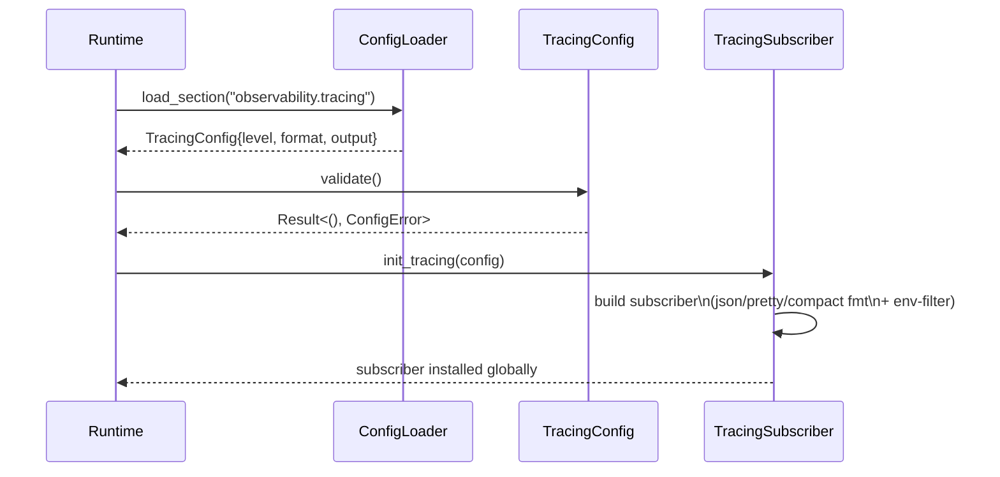
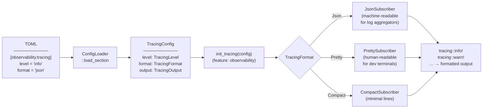

# Observability Config Architecture

## Workspace overview

The observ-config workspace is a single Rust crate — `swe-edge-observ-config` — that
provides typed configuration for the observability stack (tracing, metrics, log format).
It is consumed by `runtime/` to initialise `tracing-subscriber`.

| Crate | Package | Purpose |
|-------|---------|---------|
| `observ-config/swe-edge-observ-config` | `swe-edge-observ-config` | Observability configuration types and validator |

---

## SEA module layout

```
src/
├── api/
│   ├── observability_config.rs     # ObservabilityConfig — top-level config struct
│   ├── tracing_config.rs           # TracingConfig — level, format, output
│   ├── tracing_format.rs           # TracingFormat — Json | Pretty | Compact
│   ├── tracing_level.rs            # TracingLevel — Trace | Debug | Info | Warn | Error
│   ├── config.rs                   # Config — TOML section key and defaults
│   ├── error.rs                    # Error — validation errors
│   ├── traits.rs                   # Validator trait — config validation contract
│   └── swe_edge_observ_config.rs   # SweEdgeObservConfig — root config type
├── core/
│   └── default_swe_edge_observ_config.rs  # Default implementation
├── saf/
│   └── mod.rs                      # Public factory surface
└── lib.rs                          # pub use saf::*
```

---

## Configuration shape

```toml
# config/application.toml
[observability]
enabled = true

[observability.tracing]
level  = "info"      # trace | debug | info | warn | error
format = "json"      # json | pretty | compact
```

---

## Key contracts

| Type | Role |
|------|------|
| `ObservabilityConfig` | Top-level config — `enabled` flag + nested `TracingConfig` |
| `TracingConfig` | Tracing level, format, and output destination |
| `TracingLevel` | Enum — `Trace`, `Debug`, `Info`, `Warn`, `Error` |
| `TracingFormat` | Enum — `Json`, `Pretty`, `Compact` |

---

## Sequence

> `TracingConfig` is loaded from TOML; `init_tracing()` installs the subscriber once at process startup.



## Data Flow

> A TOML `[observability.tracing]` section becomes an installed `tracing-subscriber`; all subsequent `tracing::` calls are routed through it.



## See Also

- [Config Architecture](../../../config/swe-edge-config/docs/architecture.md)
- [Runtime Architecture](../../../runtime/docs/architecture.md)
- [Architecture Overview](../../../docs/3-architecture/architecture.md)
